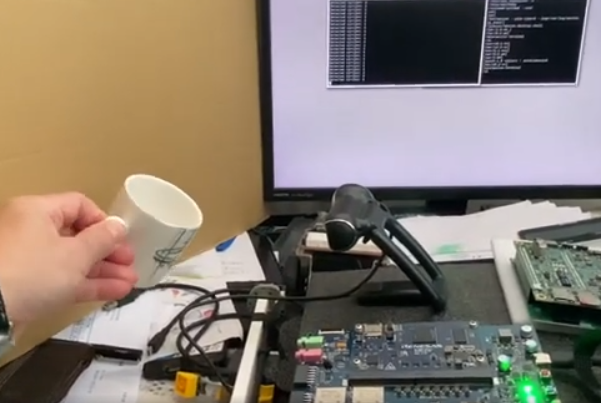
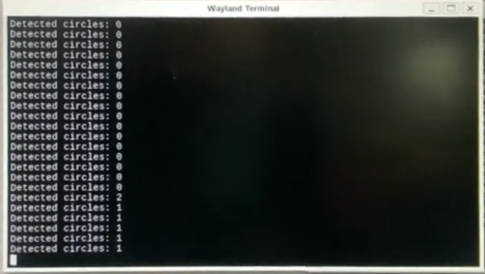

# Circle Detect

This is a sample OpenCV program running on Renesas RZ/G2L used to detect circles. 

## 1. Environment

Download both the RZ/V2H and RZ/G2L BSP Yocto projects, 
 
Copy the OpenCV recipes from RZ/V2H project to RZ/G2L project. 

From RZ/V2H : meta-openembedded/meta-oe/recipe-support/opencv

To RZ.G2L : 

meta-renesas/meta-rz-common/recipes-graphics/opencv


Modify meta-renesas/meta-rz-common/include/
core-image-bsp.inc 
Add the below, 
```
IMAGE_INSTALL_append = " \
    opencv \
```


**Build Yocto project**

```
MACHINE=smarc-rzg2l bitbake core-image-qt
```

**Write to SD card**

```
sudo bmaptool copy core-image-qt-smarc-rzg2l.wic.gz /dev/sdc
```

**Build SDK**

```
MACHINE=smarc-rzg2l bitbake core-image-qt -c populate_sdk
```

Run the above bash script to **install the SDK toolkits** on your host computer

<work_dir>/build/tmp/deploy/sdk/poky-glibc-x86_64-core-image-qt-aarch64-smarc-rzg2l-toolchain-3.1.31.sh

The SDK will be installed to ( by default ) 

```
/opt/poky/3.1.31
```

Each time, before using of the cross compiler SDK, we need to 
do the steps,

```
cd  /opt/poky/3.1.31
unset LD_LIBRARY_PATH
. environment-setup-aarch64-poky-Linux
```

To check if the environment has been setup properly, run
```
echo $CXX
```
The output will be like the below
```
aarch64-poky-linux-g++ -mtune=cortex-a55 -fstack-protector-strong -D_FORTIFY_SOURCE=2 -Wformat -Wformat-security -Werror=format-security --sysroot=/opt/poky/3.1.31/sysroots/aarch64-poky-linux

```

## 2. Build

```
mkdir build
cd build
cmake ..
make 
```

## 3. Run

Transfer the output executable file to Renesas RZ/G2L using SD card or scp command through local network,

Insert the SD card with the bootable linux image, copy the executable to the folder

```
cp circle_detect /media/$USER/root/home/root/
```

Or, connect both your host and RZ/G2L board to LAN. 
Send the executable file from host to RZ/G2L as below,  

```
scp circle_detect root@192.168.0.220:/home/root
```

Boot the RZ/G2L, then run the commands, 

```
cd /home/root
./circle_detect
```
## 4. Result 

( click to play the video )
[](https://youtu.be/UsFkTGlTTKw)
( click to play the video )
[](https://youtu.be/iUK23yD4CAY)
